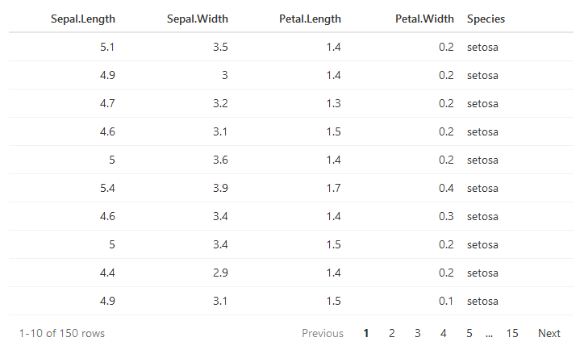

# reactable

[](https://cran.r-project.org/package=reactable)
[](https://github.com/glin/reactable/actions)
[](https://app.codecov.io/gh/glin/reactable)
[](https://lifecycle.r-lib.org/articles/stages.html#experimental)

Interactive data tables for R, based on the
[React Table](https://github.com/tanstack/table/tree/v7) library and made with
[reactR](https://github.com/react-R/reactR).

## Features
- Sorting, filtering, pagination
- Grouping and aggregation
- Built-in column formatting
- Custom rendering via R or JavaScript — use Shiny HTML tags and HTML widgets in tables
- Expandable rows and nested tables
- Conditional styling
- Works seamlessly within R Markdown documents and Shiny apps

## Demos
- [Twitter Followers](https://glin.github.io/reactable/articles/twitter-followers/twitter-followers.html)
- [Women's World Cup Predictions](https://glin.github.io/reactable/articles/womens-world-cup/womens-world-cup.html)
- [NBA Box Score](https://glin.github.io/reactable/articles/nba-box-score/nba-box-score.html)
- [CRAN Packages](https://glin.github.io/reactable/articles/cran-packages/cran-packages.html)
- [Spotify Charts](https://glin.github.io/reactable/articles/spotify-charts/spotify-charts.html)
- [Popular Movies](https://glin.github.io/reactable/articles/popular-movies/popular-movies.html)
- [Demo Cookbook](https://glin.github.io/reactable/articles/cookbook/cookbook.html)
- [100k Rows](https://glin.github.io/reactable/articles/100k-rows.html)
- [Shiny Demo](https://glin.github.io/reactable/articles/shiny-demo.html)

## Installation
You can install reactable from CRAN with:
```r
install.packages("reactable")
```

Or install the development version from GitHub with:
```r
# install.packages("devtools")
devtools::install_github("glin/reactable")
```

## Usage
To create a table, use `reactable()` on a data frame or matrix:
```r
library(reactable)

reactable(iris)
```

<!-- pkgdown:example -->
[](https://glin.github.io/reactable/articles/examples.html)

You can embed tables in **R Markdown** documents:
````
```{r}
library(reactable)

reactable(iris)
```
````

Or use them in **Shiny** applications:
```r
library(shiny)
library(reactable)

ui <- fluidPage(
  reactableOutput("table")
)

server <- function(input, output) {
  output$table <- renderReactable({
    reactable(iris)
  })
}

shinyApp(ui, server)
```

To learn more about using reactable, check out the examples below.

## Examples
- [Basic Usage](https://glin.github.io/reactable/articles/examples.html#basic-usage)
- [Sorting](https://glin.github.io/reactable/articles/examples.html#sorting)
- [Filtering](https://glin.github.io/reactable/articles/examples.html#filtering)
- [Searching](https://glin.github.io/reactable/articles/examples.html#searching)
- [Pagination](https://glin.github.io/reactable/articles/examples.html#pagination)
- [Grouping and Aggregation](https://glin.github.io/reactable/articles/examples.html#grouping-and-aggregation)
- [Column Formatting](https://glin.github.io/reactable/articles/examples.html#column-formatting)
- [Custom Rendering](https://glin.github.io/reactable/articles/examples.html#custom-rendering)
- [Embedding HTML Widgets](https://glin.github.io/reactable/articles/examples.html#embedding-html-widgets)
- [Footers and Total Rows](https://glin.github.io/reactable/articles/examples.html#footers)
- [Expandable Rows and Nested Tables](https://glin.github.io/reactable/articles/examples.html#expandable-row-details)
- [Conditional Styling](https://glin.github.io/reactable/articles/examples.html#conditional-styling)
- [Table Styling](https://glin.github.io/reactable/articles/examples.html#table-styling)
- [Theming](https://glin.github.io/reactable/articles/examples.html#theming)
- [Column Groups](https://glin.github.io/reactable/articles/examples.html#column-groups)
- [Column Resizing](https://glin.github.io/reactable/articles/examples.html#column-resizing)
- [Sticky Columns](https://glin.github.io/reactable/articles/examples.html#sticky-columns)
- [Row Names and Row Headers](https://glin.github.io/reactable/articles/examples.html#row-names-and-row-headers)
- [Cell Click Actions](https://glin.github.io/reactable/articles/examples.html#cell-click-actions)
- [Language Options](https://glin.github.io/reactable/articles/examples.html#language-options)
- [Shiny](https://glin.github.io/reactable/articles/examples.html#shiny)
- [Cross-Widget Interactions with Crosstalk](https://glin.github.io/reactable/articles/examples.html#cross-widget-interactions)
- [JavaScript API](https://glin.github.io/reactable/articles/examples.html#javascript-api)

## Browser Support
| [](https://godban.github.io/browsers-support-badges/)<br>IE / Edge | [](https://godban.github.io/browsers-support-badges/)<br>Firefox | [](https://godban.github.io/browsers-support-badges/)<br>Chrome | [](https://godban.github.io/browsers-support-badges/)<br>Safari | [](https://godban.github.io/browsers-support-badges/)<br>Opera |
| --------- | --------- | --------- | --------- | --------- |
| IE11, Edge | last 2 versions | last 2 versions | last 2 versions | last 2 versions |

## License
MIT
